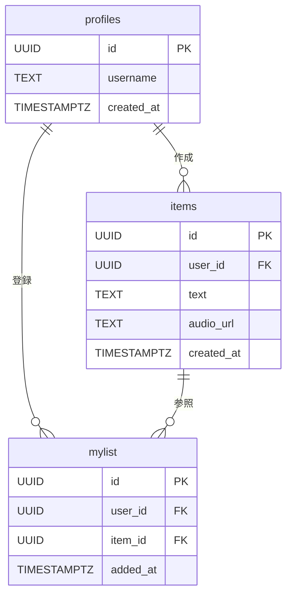

# DB設計書

## 概要

- **DB**: Supabase (PostgreSQL)
- **認証**: Supabase Auth（`auth.users` を使用）
- IDはすべて UUID を使用

## テーブル一覧

| テーブル名 | 概要 |
|---|---|
| `profiles` | ユーザーのプロフィール情報（Supabase Authと紐付け） |
| `items` | 学習アイテム（ユーザー作成・ライブラリ共通） |
| `mylist` | ユーザーが登録したマイリスト |

## テーブル定義

### `profiles`

Supabase Authの `auth.users` を拡張するプロフィールテーブル。

| カラム名 | 型 | 制約 | 説明 |
|---|---|---|---|
| `id` | UUID | PK, FK → auth.users | SupabaseのユーザーID |
| `username` | TEXT | | ユーザー名 |
| `created_at` | TIMESTAMPTZ | DEFAULT now() | 作成日時 |

---

### `items`

全学習アイテムを管理するテーブル。`user_id` が NULL のものがライブラリアイテム（管理者作成）、セットされているものがユーザー作成アイテム。

| カラム名 | 型 | 制約 | 説明 |
|---|---|---|---|
| `id` | UUID | PK, DEFAULT gen_random_uuid() | アイテムID |
| `user_id` | UUID | FK → profiles.id, NULL可 | 作成ユーザー（NULLの場合はライブラリアイテム） |
| `text` | TEXT | NOT NULL | 学習テキスト |
| `audio_url` | TEXT | NOT NULL | 音声ファイルのURL |
| `created_at` | TIMESTAMPTZ | DEFAULT now() | 作成日時 |

---

### `mylist`

ユーザーが登録したマイリスト。

| カラム名 | 型 | 制約 | 説明 |
|---|---|---|---|
| `id` | UUID | PK, DEFAULT gen_random_uuid() | マイリストID |
| `user_id` | UUID | FK → profiles.id, NOT NULL | ユーザー |
| `item_id` | UUID | FK → items.id, NOT NULL | アイテム |
| `added_at` | TIMESTAMPTZ | DEFAULT now() | 追加日時 |

**制約**: 同一ユーザーが同一アイテムを重複登録できない

```sql
UNIQUE (user_id, item_id)
```

## ER図



## 変更履歴
### v0.1 (2026-03-23)
- 初版
