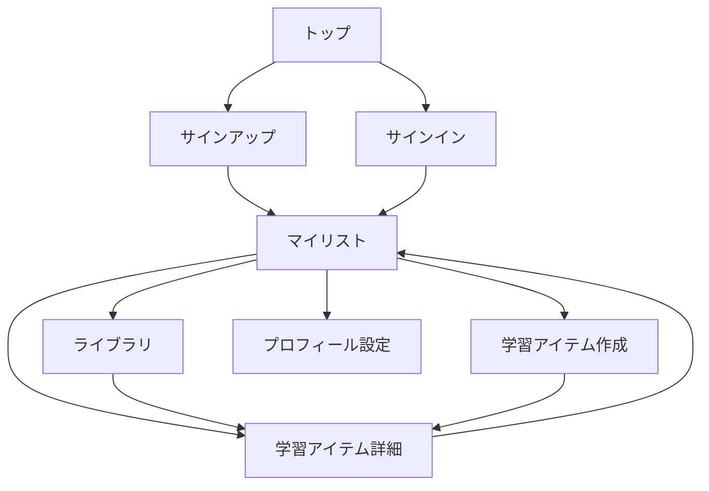

# 画面設計書

## 画面一覧

| 画面名 | ルート | 認証 | 概要 |
|---|---|---|---|
| トップ / ランディング | `/` | 不要 | サービス説明・サインイン/サインアップへの導線 |
| サインアップ | `/signup` | 不要 | メールアドレス・パスワードで新規登録 |
| サインイン | `/signin` | 不要 | メールアドレス・パスワードで認証 |
| マイリスト | `/mylist` | 必要 | 保存した学習アイテムの一覧・再生 |
| ライブラリ | `/library` | 必要 | 事前に用意された学習アイテムの閲覧 |
| 学習アイテム作成 | `/items/create` | 必要 | テキスト入力・音声生成 |
| 学習アイテム詳細 | `/items/[id]` | 必要 | テキスト確認・編集・削除・マイリスト追加 |
| プロフィール設定 | `/settings/profile` | 必要 | ユーザー名の設定・変更 |

## 画面遷移図

## 各画面の概要

### トップ / ランディング (`/`)
- サービスのキャッチコピー・説明
- サインアップ・サインインへのボタン
- 未認証ユーザーのみアクセス可（認証済みはマイリストへリダイレクト）

### サインアップ (`/signup`)
- メールアドレス・パスワードの入力フォーム
- 登録後はマイリストへリダイレクト

### サインイン (`/signin`)
- メールアドレス・パスワードの入力フォーム
- 認証後はマイリストへリダイレクト

### マイリスト (`/mylist`)
- 保存済み学習アイテムの一覧（リスト形式）
- 再生コントロール（再生/一時停止・速度調整・リピート・シャッフル）
- 学習アイテム作成・ライブラリへの導線

### ライブラリ (`/library`)
- 事前に用意された学習アイテムの一覧
- マイリストへの追加ボタン

### 学習アイテム作成 (`/items/create`)
- テキスト入力エリア
- 音声生成ボタン
- 生成後に保存してアイテム詳細へ遷移

### 学習アイテム詳細 (`/items/[id]`)
- テキスト表示・編集
- 音声の再生プレビュー
- マイリストへの追加/削除
- アイテム削除

### プロフィール設定 (`/settings/profile`)
- ユーザー名の入力・変更

## 変更履歴
### v0.1 (2026-03-23)
- 初版
